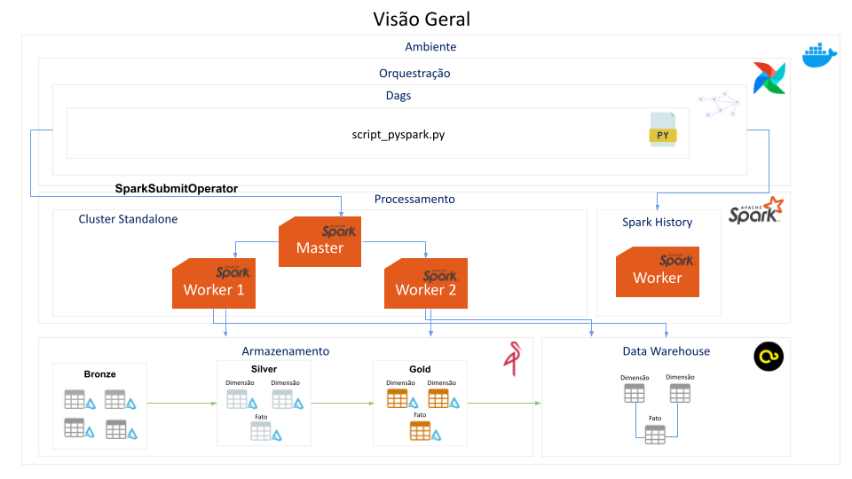

# airflow_spark
Este projeto configura um ambiente de orquestração e processamento de dados utilizando **Apache Airflow**, **Apache Spark**, **MinIO**, com suporte a múltiplos workers e execução distribuída de tarefas.
Operador usado: SparkSubmitOperator

 Este ambiente é destinado apenas para uso local e fins de desenvolvimento.

# Ambiente
 


# Como executar
```
docker compose up airflow-init
```
```
docker compose up -d
```

# Versões utilizadas
- python:3.12
- spark-3.5.6


## Criando conexões no airflow
### Spark:
- **Connection ID:** spark_standalone
- **Connection Type:** spark
- **Port:** 7077
- **extras.Deploy mode:** client
- **extras.Spark binary:** spark-submit


### Minio:
- **Connection ID:** minio_conn
- **Connection Type:** http
- **extra:**<br>
  {<br>
    "s3a.access.key": {minio_user}, <br>
    "s3a.secret.key": {minio_password}, <br>
    "s3a.endpoint": "http://minio:9000" <br>
  }

# Dag de exemplo (spark_pi_cluster_job)
 
